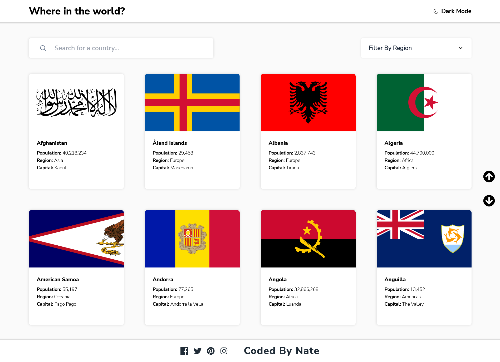

# Frontend Mentor - REST Countries API with color theme switcher solution

This is a solution to the [REST Countries API with color theme switcher challenge on Frontend Mentor](https://www.frontendmentor.io/challenges/rest-countries-api-with-color-theme-switcher-5cacc469fec04111f7b848ca). Frontend Mentor challenges help you improve your coding skills by building realistic projects.

## Table of contents

- [Overview](#overview)
  - [The challenge](#the-challenge)
  - [Screenshot](#screenshot)
  - [Links](#links)
  - [Built with](#built-with)
  - [What I learned](#what-i-learned)
  - [Continued development](#continued-development)
  - [Useful resources](#useful-resources)
- [Author](#author)
- [Acknowledgments](#acknowledgments)

## Overview

### The challenge

Users should be able to:

- See all countries from the API on the homepage
- Search for a country using an `input` field
- Filter countries by region
- Click on a country to see more detailed information on a separate page
- Click through to the border countries on the detail page
- Toggle the color scheme between light and dark mode _(optional)_

### Screenshot

### Links

- Solution URL: [Add solution URL here](https://your-solution-url.com)
- Live Site URL: [Add live site URL here](https://your-live-site-url.com)

### Built with

- Semantic HTML5 markup
- CSS custom properties
- Flexbox
- CSS Grid
- [React](https://reactjs.org/) - JS library
- [TailwindCSS](https://tailwindcss.com/) - CSS Utility Library
- [ReactRouterDom](https://reactrouter.com/en/main)

### What I learned

I learned a lot about the WebApi History and Location objects. With React Router Dom, I was able to achieve client-side routing which helped me make my app more sustainable while seeming like it actually fetches new pages from a server when it doesn't.

Working with countries that have different languages, I had to implement some language sensitive comparisons and renders.

### Continued development

I would like to work on more projects that involve routing in the future, i still have a lot to learn and understand and also, I haven't fully learnt the concepts of the React Router Dom library, although I know enough to create a SPA with routes that work efficiently.

### Useful resources

- [Web API History](https://developer.mozilla.org/en-US/docs/Web/API/History) - Learn about the web API History Interface.
- [ECMAScript Internationalization API](https://developer.mozilla.org/en-US/docs/Web/JavaScript/Reference/Global_Objects/Intl) - Learn about the internationalization API.

## Author

_Coded By Nate_

- Frontend Mentor - [@Nathandcwendy](https://www.frontendmentor.io/profile/Nathandcwendy)

- Twitter - [@nathanielsdiary](https://twitter.com/nathanielsdiary)

## Acknowledgments

Special Thanks To [MDN](https://developer.mozilla.org/en-US/) for provideing well written documentations that help developers like myself write better code.

Thanks To The Creators Of React and its other complementing libraries.

Thanks to the Creators of TailWindCSS.
